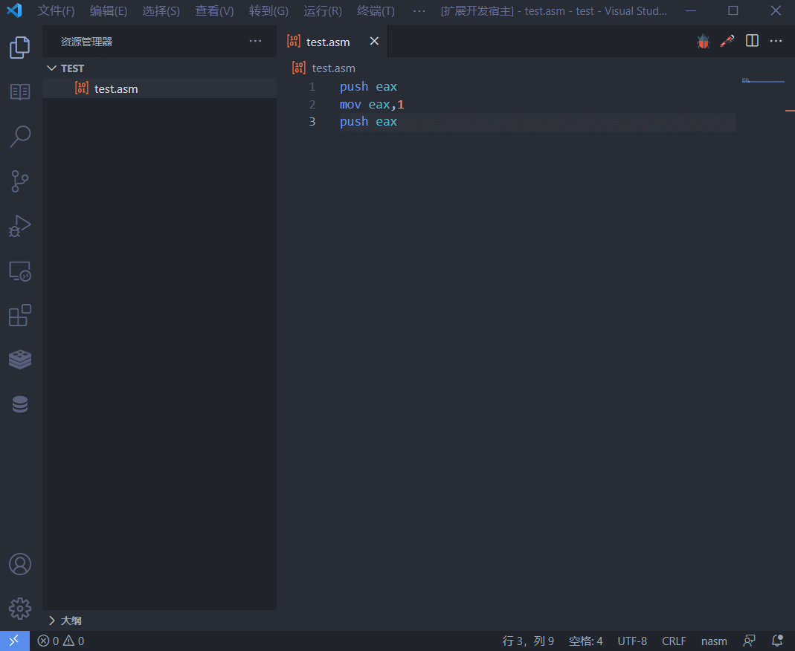
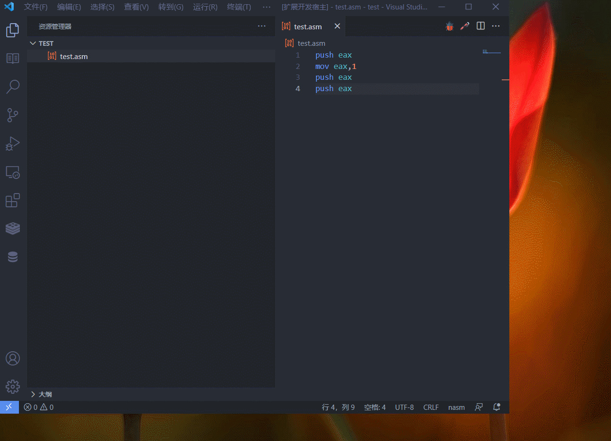
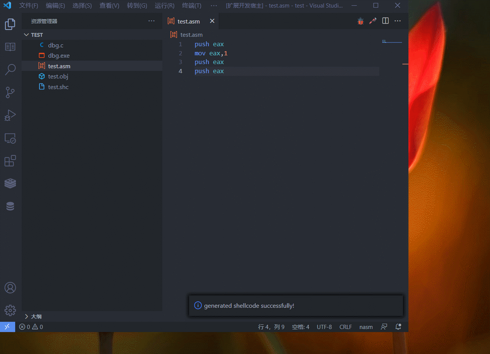

# Shellcode Studio

Shellcode-studio is used to generate corresponding binary code and debugging program from assembly file. Shellcode-studio also provides many other functions like some popular shellcode snippets.

## Features

### Generate plain binary code from assembly shellcode file

Use command :`shellcode:Generate shellcode from current asm file` or click the build button top-right to generate plain binary code from current assembly shellcode file.

### Generate Debugging program and start debug.

Click debug button top right and the plug-in will generate a c program and embed your shellcode into it. And it will open ollydbg.exe(**this means you have to set the path of ollydbg.exe in configuration page.**) with the shellcode debugging program.

You can also do this by command:`shellcode:Degbug shellcode.`

## Requirements

This plug-in currently only supports nasm assembly language. If you want to debug your shellcode via C

 program you need to install GCC.

All requirements are listed below:

+ nasm
+ GCC
+ ollydbg(if you want to debug)

## Extension Settings

**DO SET OLLYDBG PATH** if you want to debug shellcode.

This extension contributes the following settings:

* `shellcode-studio.ollydbgPath`:Path of ollydbg.exe.To dbg shellcode,do set this path.
* `shellcode-studio.clearTemFile`:whether to clear all tem files or not.

## Release Notes

### 1.0.0

Initial release of shellcode-studio.

**Enjoy!**

# Shellcode 工作室
本插件可以从使用nasm书写的shellcode汇编文件中生成无格式的二进制文件，并生成相应的c程序进行调试。
## 特性
### 从shellcode汇编文件生成无格式二进制文件
使用命令：`shellcode:Generate shellcode from current asm file`或者点击编辑器右上角的build按钮生成无格式的二进制文件。

### 生成调试程序并开始调试
使用命令`shellcode:Degbug shellcode.`或者点击编辑器右上角的调试按钮生成c调试程序，并将shellcode嵌入到程序中然后打开ollydbg开始调试shellcode。

## 相关依赖
本插件面向的时nasm汇编语言，使用gcc生成调试程序，调用ollydbg进行调试。
+ nasm
+ GCC
+ OLLYDBG

## 插件设置
**一定设置OLLYDBG路径**如果要进行调试的话。
本扩展提供以下设置选项：
* `shellcode-studio.ollydbgPath`:ollydbg的路径。
* `shellcode-studio.clearTemFile`:是否要清除中间文件。

## 发布日志
### 1.0.0
初始发布版本。

**使用愉快！**